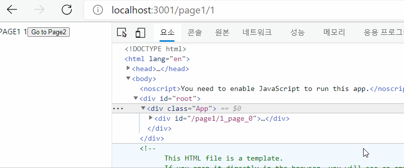

# router
 

 
```tsx
<Switch>
  <Route path="/post/:postId">
    <PostPage />
  </Route>
  <Route path="/post/write">
    <WritePage />
  </Route>
  <Redirect to="/404" />
</Switch>
```
```tsx
const PostPage = () => {
  useFocusEffect(useCallback(() => {
    console.log('Hello');
    return () => console.log('Bye');
  }, []);
};
```
